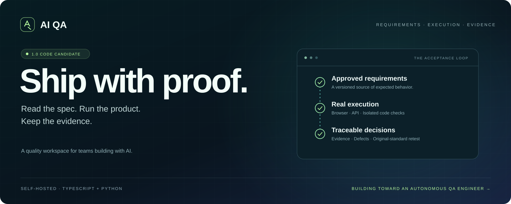
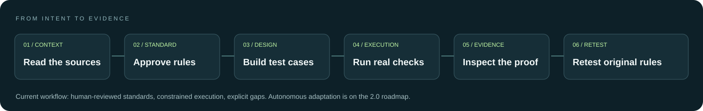
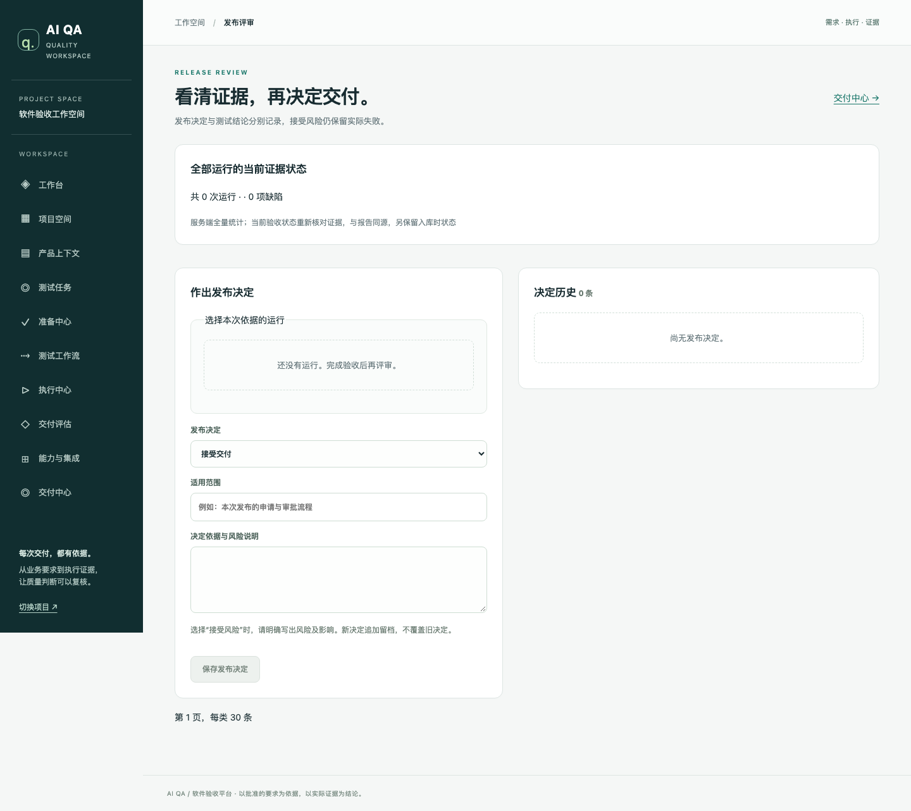

<div align="center">
  <a href="docs/product/v2.0/PRD.md"></a>
  <h3>Every release deserves evidence.</h3>
  <p>Turn versioned product requirements into reviewed test cases,<br/>real execution, traceable defects, and retesting against the original standard.</p>
  <p><a href="README.md">简体中文</a> · <strong>English</strong></p>
  <p><a href="deploy/README.md">Quick start</a> · <a href="docs/delivery/v1-code-completion-20260922.md">Verification record</a> · <a href="docs/product/v2.0/PRD.md">2.0 product spec</a> · <a href="CONTRIBUTING.md">Contribute</a></p>
  <a href="https://github.com/libowenzuishuai/ai-qa-platform/actions/workflows/intelligence.yml"></a>
</div>

## Why AI QA?

**Code ships faster. Business behavior still needs an independent check.**

AI QA connects expected behavior to observed behavior: where a test came from, which build ran, what actually happened, and whether the fix still meets the original requirement. Built for teams using AI coding tools and merging frequently.



> **Status: 1.0 code candidate for guided pilots.** This is a working platform, not a demonstrated replacement for a general-purpose QA engineer. Open harness plugins, adaptive exploration, and the full autonomous loop are 2.0 plans. Code verification, provider integration, and real-business effectiveness are reported separately.

## A look inside

Real application screenshot from an isolated acceptance environment. Empty states and forms are shown; this is not customer data or a preview of unbuilt 2.0 features.

<a href="docs/delivery/evidence/v1-release-desktop.png"></a>

[Mobile view](docs/delivery/evidence/v1-release-mobile.png) · [Change review](docs/delivery/evidence/change-review-desktop.png) · [Persistent workflows](docs/delivery/evidence/p0-workflows.png)

## Available today

| Area | Current implementation | Boundary |
|---|---|---|
| Requirements | Markdown, DOCX, PDF/image ingestion; source references; multi-file changes; resumable chunks | Extraction quality and uncovered scope remain explicit |
| Test design | Rule/case proposals, human approval, immutable versions | Completeness and business correctness still require review |
| Execution | Browser actions, role isolation, HTTP API checks, screenshots and traces | Approved plans, not unrestricted autonomous exploration |
| Orchestration | Login checks, HTTP data plugins, 11 built-in capabilities, human gates and recovery | Open adapters and dynamic agent loops are planned |
| Engineering | Node test, pytest, Vitest, Jest, Playwright, lint, typecheck, build and LCOV | Existing code checks are distinct from business acceptance |
| Deployment | Ephemeral Node HTTP service with optional PostgreSQL and cleanup accounting | Not an arbitrary-project deployment platform |
| Reporting | Defects, assignees, original-standard retest, decisions, JSON/Markdown exports | Accepting risk does not overwrite FAIL |
| GitHub | Public repository checks; App/webhook/Checks implementation | Real App installation and provider round-trip still await validation |

### Evidence, not a marketing score

At the **2026-09-22 fixed code snapshot**, 561 TypeScript checks, 374 Python checks, 34 runner checks, and 6 public-GitHub end-to-end checks passed. Skips and unverified real-model paths are listed separately. Production-image checks covered a clean database, upgrade, evidence/database restoration, and a fresh Chromium run.

These are tests of the platform, **not a defect-detection rate or customer-success metric**. [Read the record](docs/delivery/v1-code-completion-20260922.md) and [image/log hashes](docs/delivery/evidence/v1-local-release-20260922.json). Tested execution source: `214b89c`. Historical counts are not a live CI claim.

## Quick start

Requires Docker with Compose and network access for the first build.

```sh
git clone https://github.com/libowenzuishuai/ai-qa-platform.git
cd ai-qa-platform
cp -n deploy/.env.production.example deploy/.env.production
```

Fill database credentials, `SESSION_SECRET`, `AIQA_INTELLIGENCE_TOKEN`, and the initial administrator fields in that local file. Configure `AIQA_TEXT_*` / `AIQA_VISION_*` for model-backed operations.

```sh
docker compose -p aiqa-prod \
  -f deploy/compose.production.yaml \
  --env-file deploy/.env.production \
  up -d --build --wait --wait-timeout 180
```

Open **http://127.0.0.1:7100** and sign in with the configured administrator. Migrations and initialization run automatically. Without a configured model, browsing and approved assets remain available; model-backed operations report missing configuration.

First journey: create a project → connect a test URL/repository and requirements → prepare roles → review rules/cases → approve a plan → execute and inspect evidence. Initial setup is required.

[Deployment](deploy/README.md) · [Development](docs/DEVELOPMENT.md) · [Self-hosted runner](tools/self-hosted-runner/README.md) · [Pilot evaluation](tools/pilot-acceptance/README.md)

## Toward 2.0 — planned, not shipped

- **Composable harness:** add an adapter without editing core dispatch; repeatable nodes, subflows, bounded loops.
- **Adaptive test loop:** observe, plan, act, verify, and adjust with recoverable state and explicit budgets.
- **DOM + visual interaction:** dynamic UI, dialogs, uploads/downloads, frames, and visual controls.
- **Code testing and investigation:** propose tests from independent requirements; connect traces, logs, requests, and code changes.
- **Model roles:** separate generation, vision, and typed decision adapters; evaluate Jev before adoption.
- **Honest benchmarks:** publish defect recall, false positives, intervention, time, and cost with first failures preserved.

[Full 2.0 PRD](docs/product/v2.0/PRD.md) · [Harness specification](docs/product/v2.0/HARNESS-SPEC.md) · [Evaluation gates](docs/product/v2.0/EVALUATION.md) · [Roadmap](docs/product/v2.0/ROADMAP.md)

## Build with us

Bring an authorized Web project, clear requirements, or a reproducible failure. Business fixtures, execution adapters, and reliability counterexamples are especially useful.

[Report a bug](https://github.com/libowenzuishuai/ai-qa-platform/issues/new?template=bug_report.yml) · [Suggest a capability](https://github.com/libowenzuishuai/ai-qa-platform/issues/new?template=feature_request.yml) · [Contribution guide](CONTRIBUTING.md)

Star or Watch if this direction matters to your team. We will publish evidence and limits alongside new capabilities.

## License

A project-level open-source license has not yet been declared. Public source is not the same as an open-source grant. The rights holder will confirm licensing; dependencies retain their own licenses.
