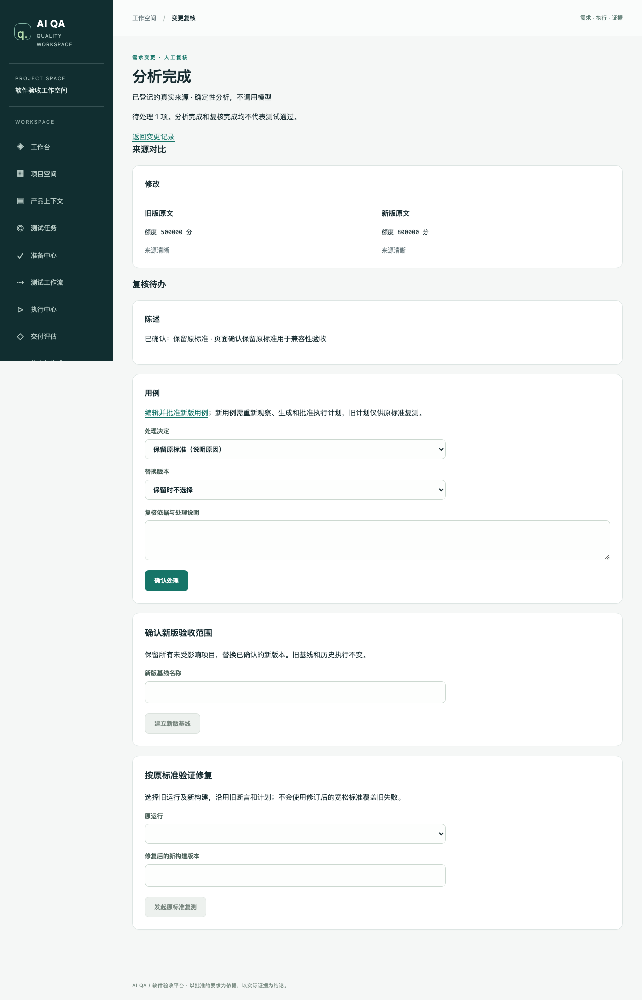

# 合并结果、变更复核交付与 PRD 差距

2026-09-21。本文是本轮最新状态，取代旧交接文档中的等待分工；历史测试结果仍保留原时间和范围。

## 结论

B 的 `v1/b3-pilot-and-mixed@e81cc3c` 经修复后合入 main。此前 B `v1/document-fidelity@aeb1b81` 与 C `v1/pilot-test-design@7ee3519` 已在 main；本轮远端复核未发现尚未合入的新分支提交。

下一轮平台工作 P0-4 已完成受支持路径：资料版本比较 → 影响清单 → 人工逐项确认 → 规则/用例新版本 → 新版基线；修复验证则继续使用原基线与原计划。不是整个 1.0 PRD 已完成，也不是任意 Git 仓库都能自动验收。

## B3 评审结论

- b3-08 是真实试点的脱敏观察资料解析回归，mock-covered 声明合理。不是官方 PRD 或 Dify 自动验收结果。
- 旧 b3-09 的 `humanCheck 12/12` 是全局去重文本匹配，无法证明页码和表格对应，更不能称为人工检查。
- 已补 14 项逐页文本与 4 项角色/金额对应检查、异常保存、防覆盖、输入校验和与完整解析输出。
- 真实 Kimi 重跑通过 14/14 + 4/4，3 次调用；首次代理配置失败也留档。新记录明确 `manualReviewPerformed=false`。详情见 [B3 评审](b3-pilot-mixed-review.md)。

## 本轮实际可用功能

| 功能 | 实现与验证边界 |
|---|---|
| 发起变更分析 | 从服务端加载同项目、同资料、同格式的新旧解析版本与批准基线；冻结输入及校验和。页面选择资料和基线，无需粘贴 JSON |
| 持久化与恢复 | CHANGE_REVIEW 复用已有队列/对账/租约机制。入队失败后补投；失联进入明确失败并支持固定输入重试；取消后旧响应不能发布 |
| Python 计算与 TS 复核 | Python 比较来源并传播到关联规则/用例。两端共同拒绝伪造来源、遗漏变化、扩大/遗漏影响、质量下降静默忽略。该操作不调用模型 |
| 查看与处理 | 新旧原文并排、质量说明、模拟来源提示、待复核清单；每项决策记录人、理由和时间，并发确认不能覆盖 |
| 修订资产 | 受影响规则生成 DRAFT，选择新版来源并编辑业务字段；正式审批使用已有入口。用例采用直接替代且已批准的新版本，关联规则必须对应 |
| 新版验收范围 | 全部待办确认后创建新版基线，保留未受影响资产、范围与排除项；不修改旧基线。新用例需新计划，不能借用旧绑定 |
| 原标准复测 | 页面选择旧运行、新构建，沿用原用例/断言/计划。实测旧构建 FAIL、新构建 PASS，旧 FAIL 保留 |
| 页面 | 资料审阅与用例页提供变更入口。列表分页，桌面并排、手机上下排列，表单实际提交通过。截图见下方 |

入口：资料审阅页 → 需求变更；列表 `/projects/:id/changes`，详情 `/changes/:id`。后台调用 Python `/v1/changes/analyze`，复用内部鉴权。

[手机页面截图](evidence/change-review-mobile.png)

## 验证记录

| 验证 | 本轮结果 |
|---|---|
| `pnpm test` | **387 通过，6 跳过**。跳过项仍属于 opt-in 或已有未启用测试，不计入通过 |
| `pnpm test:intelligence` | **281 通过**；有 5 条依赖弃用/pytest 收集警告，未出现失败 |
| 新变更集成 | 9/9：实际 PostgreSQL/Python HTTP/Chromium；权限、幂等、失联、SIGKILL、资产修订和 FAIL→PASS 复测 |
| 文档解析 | 64/64，包含新增评测器反例；包含在 Python 总数内，不能再次相加 |
| 跨语言契约 | 19 组共享正反例，两端验证；Schema 导出和 Python 模型生成一致性检查通过 |
| 类型检查 | 全仓通过 |
| 真实模型 | 仅三页合成混排 PDF 的 Kimi 视觉解析重跑；不代表真实客户 PRD 全链质量 |
| 本地迁移 | 先备份本项目开发库并核对备份目录，再应用 `20260921150000_change_review`；没有重置数据库 |

完整 TS 回归包含实际 BullMQ 工作流。新增 change-review 测试自身通过受控投递器调用生产处理函数，不把它单独宣称为 BullMQ 全链；生产队列调度由既有 P0 集成测试覆盖。SIGKILL 测试确认认领后失联可恢复，不是生产规模故障注入。

本机日志：`/tmp/aiqa-p04-final-tests.log`、`/tmp/aiqa-p04-python2.log`、`/tmp/aiqa-p04-ui-final.log`。日志不入库。开发库备份位于忽略目录 `data/backups/pre-change-review-20260921.dump`，不上传。其他环境更新需安装锁定依赖、生成 Prisma 客户端、执行 migrate deploy，再重启 API/worker/Python/web；本轮未验证全新容器安装。

## 对照 PRD：还有什么

### 1.0 发布前应优先补齐

| 优先级 | 缺口 | 验收标准 |
|---|---|---|
| P0 | 完整安装与升级交付（P0-6） | 干净机器上 API/web/worker/Python 镜像与迁移全部跑通，健康检查、升级与备份恢复文档可复现 |
| P0 | 真实项目完整验收 | Dify 仍缺批准的业务标准、独立角色/权限矩阵、构建身份与完整自动执行证据。至少完成真实资料→批准→计划→浏览器→缺陷/修复对照，再加第二种实际业务项目 |
| P0 | 变更追踪范围 | 当前手动选择同一资料的两个版本。尚无 Git 快照间多文件更新、删除、重命名的自动汇总；新增需求只进入来源待办，需要重新提取/批准并另建扩展基线，不能据此声称新增需求已纳入测试 |
| P0 | 全流程体验收尾（P0-5） | 新变更页可用；各旧页搜索、完整分页、业务人员分配、覆盖关系、风险接受和结果导出仍需统一验收。当前选择器仅展示最近 100 份资料/基线，并明确告知 |
| P0 | 长资料处理 | 现有输入上限会明确拒绝，分块、跨块规则合并与覆盖对账还未实现 |

### 规模化与通用智能体能力

- 私有 Git 授权、多服务项目接入、仓库 CI/PR 自动触发与结果回传；源码自动部署应使用明确受支持模板。
- 通用能力注册表、版本化组合模板与可视化编排：当前固定工作流已经能恢复，但不能随意拼装任意工具。
- 受控探索、带来源和失效条件的项目记忆、可核验失败诊断；模型不能自行修改验收预期或把不确定写入盲目重试。
- 扩展代码检查框架、lint/typecheck、覆盖率与受控变异评测；已有 Node/pytest/构建检查不等于业务正确性证明。
- 多组织隔离、凭据生命周期、配额、证据保留策略、审计导出和生产负载验证。
- 移动端测试、视觉回归、性能测试另列能力，不以当前 Web/API 执行器名义承诺。

TypeSafe 接入不是当前发布阻塞项；现有 TS 平台 + Python 智能处理架构仍适合继续开发。

## 试点设计的后续输入

已将现有可证实的 Dify 观察整理为 [候选用例与阻塞清单](pilot-dify-candidate-design.md)，不再等待按 A/B/C 分配才能开始。没有依据的权限、多角色、最大长度与重名规则继续明确阻塞。planner-v3 保留，未修改提示词就不空升版本。
