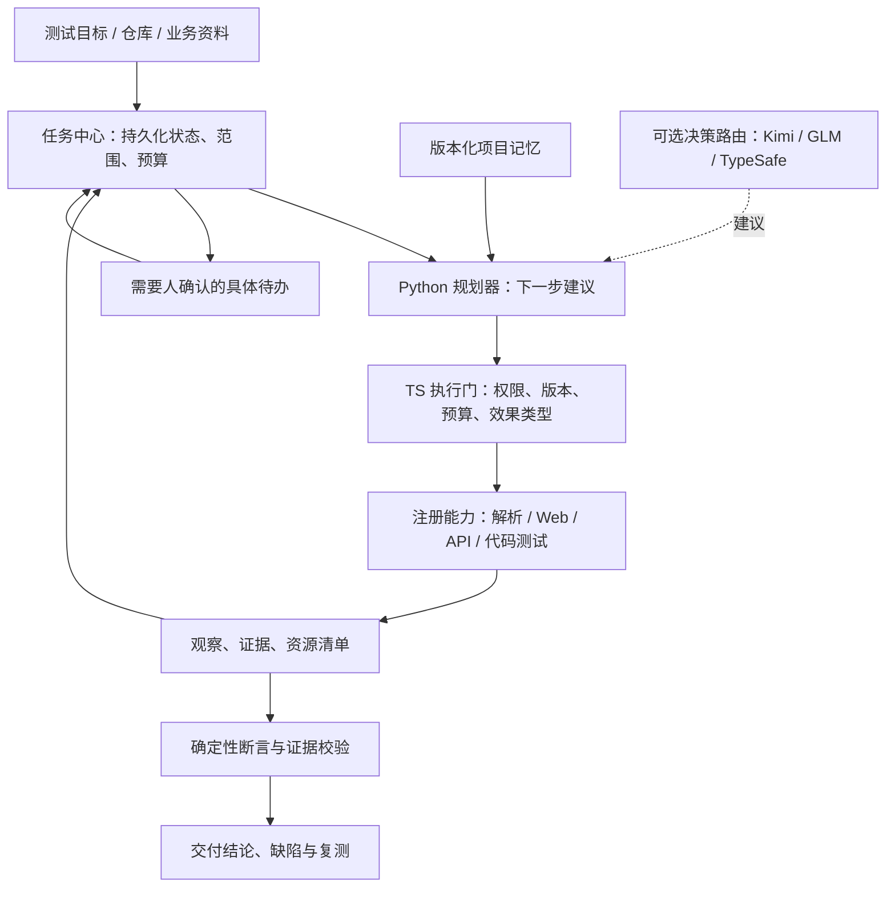

# AI QA：代码收尾与测试智能体路线

> 2026-09-21 最新：B3 分支已复核，P0-4 已补齐受支持的变更复核与原标准复测闭环。以 [本轮交付与 PRD 差距](../../delivery/p04-completion-and-prd-review.md) 为准。以下较早更新和分工保留为历史。

> 2026-09-21 B/C 合入更新：来源差异与影响分析纯模块、共享契约、脱敏试点包已完成，见 [合入裁决与后续任务](../../delivery/bc-integration-decision.md)。P0-4 的平台作业/页面/复核闭环仍未完成；下文旧分支状态仅作历史参考。

> 2026-09-21 更新：P0-1/2/3 已进行代码复核、真实集成补齐；能力、升级条件和验证边界见 [P0 复核与补齐](../../delivery/p0-review-and-hardening.md)。下面的路线保留阶段边界，P0-4/6 不因本次交付自动视为完成。

2026-09-20 · 对照本地 `b24dcef`、远端 `main=9c6aa18`、C 分支 `c889534`。本文是开发安排，不是已实现能力声明。

## 1. 判断

产品已经有可运行的测试链。下一阶段要把“人依次操作多个入口”变成“给定目标，系统推进任务，必要时带着具体问题请人确认”。主要工作是可靠编排、接入体验和能力扩展。继续复用现有 TS 执行与状态平台、Python 智能分析，不需要更换全栈。

“像 OpenClaw 一样能办事”在本产品中应具体化为：理解测试目标、读取项目上下文、选择已有工具、执行后观察、保存进度、失败时定位、在已授权范围内恢复、形成带证据的结果。不能仅增加聊天窗口或多角色名称来声称具备这些能力。

代码可以先完成独立模块和本地集成；发布仍需实际项目、账号、模型与部署条件验证。没有资料、版本或账号时应有明确阻塞状态，不能用示例数据填补。

## 2. 当前已有什么

| 能力 | 已有实现依据 | 仍缺的部分 |
|---|---|---|
| 资料理解 | Python `doc_ingestion`，文档作业与来源片段 | 复杂资料质量、长文档分块、来源变化模块 |
| 规则与测试设计 | `agents/service.py`、`prompts.py`、联合契约校验 | 真实需求整链质量、澄清后的续跑与影响分析接线 |
| 页面计划与执行 | `agents/planner.py`、worker observation、TestPlan、test-runtime | 可管理的账号登录流程；探索和正式执行分层 |
| 项目接入 | Git 固定提交、资料发现/导入、环境登记 | 私有仓库、多服务项目、成熟的缺口向导 |
| 测试资产 | 版本化规则/用例/计划、基线、完整用例编辑 | 来源变更复核、可视化覆盖关系、组合模板版本 |
| 验收执行 | 浏览器、HTTP 模板、真实证据、取消/预算/对账 | 通用数据准备/回收；任务级检查点与恢复 |
| 工程检查 | Node 内置测试、pytest、Node build，自有 Docker runner | Vitest/Jest/Playwright 等适配、仓库 CI 触发；源码自动部署另立里程碑 |
| 结果闭环 | 证据校验、缺陷出现记录、原标准复测 | 面向业务的报告、风险接受记录、归因与稳定性面板 |
| 前端 | 七个真实 SSR 页面；本轮升级共享导航、工作台、项目卡片和表单 | 资料/规则双栏审阅、准备表单、可操作执行时间线、完整集成页 |

远端发现 `v1/pilot-test-design@c889534`：新增 planner 五类样例、资料分类测试、重复运行评测模块与 C3 影响分析骨架。本轮只查看提交及差异，**未运行该分支测试、未评审通过、未合并**。它应进入集成评审，不再另写同功能；B2 输出尚未确认，不能把 C3 骨架当作需求变更全链完成。

## 3. 分成两次交付

### 交付一：1.0 代码收尾

1. **P0-1 账号与准备中心**：角色账号引用、登录步骤表单、登录结果检查、环境健康/构建核验、缺口到具体修复入口。
2. **P0-2 测试数据插件**：已注册准备/清理能力，项目/运行命名空间、资源清单、独立清理预算、失败可追踪。
3. **P0-3 持久化任务编排**：把资料→规则→用例→观察→计划→执行→评估串联；利用现有 Job/Run，增加检查点、人工待办与续跑。
4. **P0-4 变更影响集成**：评审 C 分支，统一 B2/C3 最小契约，TS 校验真实 ID 后生成待复核资产；旧任务不变。
5. **P0-5 完整业务 UI**：延续本轮视觉，消除核心流程的 JSON/内部 ID 输入，显示预算、证据和未验证范围。
6. **P0-6 可安装交付**：完整容器镜像、迁移/升级、健康检查、干净环境验证和演示数据隔离。

先完成 P0-1 → P0-2 → P0-3；P0-4 依赖 B/C；P0-5 随对应 API 完成；P0-6 在接口收敛后验收。详细合同见 [GLM 开发任务书](GLM-DEVELOPMENT-PROMPT.md)。不承诺“全部代码完成=任意项目都能测试”。

### 交付二：可组合、自主推进的测试智能体

| 优先级 | 工作 | 可验收结果 |
|---|---|---|
| P1-1 | 能力注册与版本化组合模板 | 资料解析、规则、计划、Web/API/代码执行统一输入输出描述，可串并联；模板固定版本；首版使用表单，拖拽后置 |
| P1-2 | 目标规划与受控探索 | 自然语言目标形成范围草稿；缺信息能追问；探索观察可回收为计划建议，不能自行更改验收预期 |
| P1-3 | 项目记忆与失败诊断 | 有来源/版本/失效条件的项目知识；给出可核验失败原因和下一动作；重跑写入需要确定幂等或人工核对 |
| P1-4 | 工程检查与 CI | 适配受支持测试框架、lint/typecheck；PR/commit 自动触发和结果回传；工程结果与业务验收分别显示 |
| P1-5 | 可选决策路由 | 同一接口对比现有模型与 TypeSafe，先只记录建议、延迟和成本，不影响运行决策 |
| P2 | 高级能力 | 多智能体有界并发、拖拽画布、自动部署模板、视觉回归、性能测试、移动端；按需求分别立项 |

### 代码准确性测试的定位

- 当前已能运行受支持的既有单元测试、构建；不能据此宣称代码业务正确。
- 下一步加 lint/typecheck、不同测试框架适配、覆盖率、变更触达的已有测试；这些是可客观记录的工程信号。
- 模型可提出边界用例和候选缺陷，但预期优先依据批准 PRD/接口契约；不能把读取实现后复述实现的测试当成独立正确性证据。
- 以后可用受控变异测试评估测试是否能发现人为缺陷。变异只在任务隔离副本执行，不能改用户工作树或部署环境。

## 4. 智能体架构

模型建议与执行分开：模型能决定“建议调查哪里”，服务端决定“是否有权执行、当前版本是否一致、是否有预算”。正式验收使用批准快照和现有断言引擎。

**可恢复不是盲目重跑**：只读查询可有界重试；完成记录明确的动作直接读取结果；写入结果不确定进入人工核对。进程退出后先恢复任务状态，不能从头再点一遍付款、提交或创建。

## 5. TypeSafe AI 对本项目的作用

此处指 [typesafe.ai](https://typesafe.ai/) 的 Jev。官方接口按预先给定选项返回 Choice/Score/Noul 等结构化判断；它不承担自由文本生成。[官方介绍](https://docs.typesafe.ai/introduction)

**建议用途（待评测）**：资料用途分类、从已注册能力中选下一工具、选择“继续观察/请求澄清/结束”、对候选问题排序。复杂 PRD 理解、用例和计划生成继续使用现有模型；确定性字段验证继续用 Zod/Pydantic。

Choice/Score 的 confidence 是其概率分布的统计量；不能直接当作“业务正确概率”，阈值需在本项目样本上校准。[官方 confidence 说明](https://docs.typesafe.ai/confidence)

类型匹配不代表业务结论正确。不能让任何模型的高置信度覆盖失败断言、证据缺失、权限检查或来源冲突。也不应把官网关于速度/成本的测试直接当成我们环境的收益。

先定义 `DecisionProvider`，默认保持现有模型或确定性规则；TypeSafe 配置独立凭据后才可启用。其接口为专用 `/v1/systemone`，不能假设兼容聊天补全。记录实际模型版本、输入版本、输出、耗时、错误和用量，断线回退到可追踪的默认方案。[官方 API 快速开始](https://docs.typesafe.ai/introduction/quickstart)

本轮未安装 SDK、未调用该服务、未传输项目资料。先用可公开的合成样本做旁路比较，满足准确性、覆盖率、延迟与成本要求后再考虑接入。它是可选优化，不阻塞 1.0。

## 6. 借鉴 OpenClaw 的什么

OpenClaw 官方描述的循环包含上下文组装、模型调用、工具执行、流式事件和持久化；技能系统把任务说明与工具能力组织起来。[Agent loop](https://docs.openclaw.ai/concepts/agent-loop)、[Skills](https://docs.openclaw.ai/tools/skills)

对 AI QA 有用的是这些工程机制：持续任务、能力目录、项目上下文、执行前后钩子、观察反馈与恢复。我们应借鉴设计，保持自己的需求来源、冻结标准与验收报告契约。无需先复制整套个人助理、消息渠道或技能市场，也不假定其运行时能直接替换现有测试引擎。

## 7. 本次前端交付

- 真实代码：`apps/web/src/design-system.ts`、`dashboard.ts`，以及共享 layout、项目列表、表单和导航。
- 设计预览由真实组件生成：`tools/render-product-preview.ts` → `preview/`，含工作台、用例编辑、能力组合设计。示例数据不进入产品 API。
- 能力组合页只作为下一阶段设计；真实运行中的组合引擎尚未实现。
- 当前样式：深松绿侧栏、灰白内容区、低饱和绿主动作，风险使用琥珀色/红色，状态同时提供文字。桌面侧栏、手机横向导航。
- 本轮未迁移到 React 或引入第二套前端框架；后续若交互复杂度确实需要，再单独评估迁移成本。

## 8. 交付顺序与人员协作

- GLM 优先负责 A 线 P0-1/2/3，在当前前端与平台分支基础上增量开发。
- 原泽菲继续 B 线资料质量与 B2 来源差异；未见新分支不能推断她没有本地进展，合并前核对。
- 李琦双的 C 分支先评审，再接 P0-4；避免 GLM 同时修改她的 planner/impact/evaluation。
- 共享契约、迁移和公共 API 由 A 统一修改；模块按依赖合入，不能三方分别生成相互不一致的类型。
