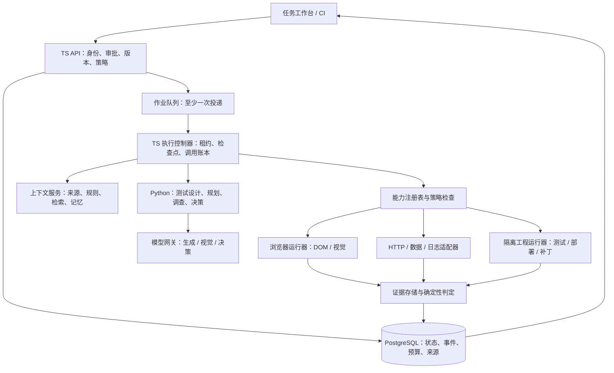

# 2.0 技术架构与迁移设计

> 设计提案；不表示接口、表或模型适配器已存在。与 [PRD](PRD.md) 和 [Harness 规格](HARNESS-SPEC.md) 联读。

## 1. 架构原则

保留 TypeScript 负责产品和执行权威，Python 负责模型与算法。不是把所有代码改成 Python，也不是把业务状态放进模型聊天记录。运行是否取消、授权是否有效、证据是否成立由平台判断。

队列是唤醒机制，数据库是状态事实来源。远程工具和模型都不能直接修改正式业务 verdict。

## 2. 三个彼此分离的模型

### 2.1 业务标准模型

SourceSnapshot → SourceSpan → ApprovedRuleVersion → OracleSpec。包含条件、角色、单位、容差、预期和来源。版本内容不可变；需求变更发布新版本。允许模型提出建议，但只有批准版本能作硬标准。

### 2.2 操作模型

ActionPlan / Observation / Invocation / EffectReceipt。用于描述怎么到达目标、元素指向哪里、哪个账号执行，以及行为是否产生外部效果。可在范围内重规划；绑定必须对应当前页面观测，旧截图坐标不能跨页面复用。

### 2.3 结论模型

Finding / Evaluation / ReleaseDecision。事实、假设、证据有效性、人工裁决和发布决策分开。业务标准未验证不能因“模型很自信”而 PASS；用户接受风险不改变原 FAIL。

## 3. 持久化执行循环

执行控制器每轮读取当前 session、租约、取消标记和预算，然后完成：

1. 采集观察，持久化观测摘要与证据引用。
2. 构造受限上下文，交给 Python 提议下一步；计划必须通过结构和语义校验。
3. 在事务中登记调用 intent、预留预算、附带 fencing token。
4. 工具执行；实时记录副作用回执与资源台账。
5. 验证输出，确定业务判定能否执行；持久化结果、检查点和事件。
6. 达到目标则汇总；未达目标且有进展则继续；出现阻塞或无进展则暂停/停止。

模型调用期间取消，返回结果只能存档，不能再派发业务动作。租约丢失的 worker 不可提交有效结果，但外部动作可能已经发生，因此恢复者必须先查回执与业务状态。

预算分别记录 wallTime、activeTime、modelCalls、input/output tokens、toolCalls、parallelSlots、estimated/knownCost；人工等待不消耗 activeTime，但受独立等待保留期限。超时请求的费用可能未知，不能归零。无法硬限制外部服务已经发生的计费，要以预留和最大响应限制约束新的调用。

## 4. 真实业务上下文

上下文包必须包含具体内容，而不是 hasDocuments 标记：

- 固定资料版本、可信来源片段、批准规则、冲突与未解析范围。
- 目标涉及的角色、数据状态、接口、页面和构建信息。
- 历史运行的可复核证据及有效记忆，注明适用版本与失效原因。
- 尚未解决的问题、预算和允许工具目录。

检索采用可替换接口。先做关键词/结构过滤 + 来源和规则关联的基线，再评估向量/重排是否改善召回，不把向量数据库作为天然必选。检索结果保存 selected/rejected、分数、引用和 token 占用；摘要保留原文链接与未覆盖片段。质量门验证否定、条件、单位、跨块引用没有丢失。

记忆只复用定位习惯、成功准备策略、已确认故障线索等经验，不覆盖当前批准标准。每次记录 retrieved/used/rejected/outcome；过期、矛盾、跨项目记忆拒绝，并能追溯为何影响了本次计划。

## 5. 模型适配与 Jev

| 角色 | 输入/输出 | 主要用途 | 不得承担 |
|---|---|---|---|
| Generator | 文本/结构化上下文 → 草稿、计划、代码候选 | 测试设计、规划、调查、解释 | 自行授予权限、篡改批准标准 |
| Vision | 当前图像 + 任务 → 元素/布局/视觉候选 | DOM 不足时定位和辅助检查 | 仅凭主观描述认定金额、权限、持久化正确 |
| Decision | 限定状态 + 选项/问题 → 类型化选择/评分 | 路由、排序、低成本原子判断 | 生成长篇 PRD、测试代码或单独裁决业务 PASS |

[Jev 官方介绍](https://docs.typesafe.ai/introduction)给出 Choice、Score、Noul 等结构化决策类型。因此 Jev 适合尝试：在已授权工具中选一个、给缺陷候选排序、识别当前是否需要人工；不应强行接成 OpenAI 聊天接口。

实施次序：统一 DecisionProvider 接口 → 确定性规则基线 → 普通模型结构化决策基线 → 可选 Jev 适配器。每次保存候选集合、实际选择、原始置信度、耗时/费用和最终任务结果。供应商 confidence 不是经过本项目校准的正确概率；需单独校准和拒识策略。没有 Jev 配置时产品完整可用。

Jev 是否保留由同状态回放与端到端 A/B 决定：错误路由率、人工接管、业务缺陷召回、费用和 p95 延迟一起比较。不能用局部调用快掩盖总体失败增加。

Moonshot 与其他国内模型作为生成/视觉提供商候选，以同一冻结评测选择；模型名称、上下文/图像支持、价格需在接入时查验，不把本文写成长期不变的排行榜。

## 6. 浏览器与工程运行器

浏览器保留 Playwright 的会话、隔离、连接策略与确定性动作。Stagehand 只通过候选适配器接入，不允许绕过网络/文件/授权约束。视觉操作记录截图尺寸、缩放、frame 和观测时刻；动作后重新观测，失败时保留首个证据。

工程运行器在隔离环境 checkout 固定 SHA，锁定依赖，资源/网络受限。仓库文档与安装脚本视为不可信；不注入平台数据库权限或宿主凭据。生成测试写到临时工作区，记录 patch、独立预期来源、运行报告、变异结果与限制，不能通过修改产品实现消除失败。

对代码结果分别报告：构建、现有测试、生成候选测试、代码覆盖、变异检出、业务规则覆盖。各有分母，不汇总为一个“项目正确率”。

## 7. 新增实体（逻辑提案）

| 实体 | 关键内容 |
|---|---|
| CapabilityInstallation / CapabilityVersion | 来源、摘要、Schema、权限、兼容、撤销状态 |
| HarnessProfileVersion | 精确插件/模型/策略/判定配置 |
| OracleSpecVersion | 规则引用、判定方法、expected、内容哈希 |
| ExecutionSession / Checkpoint | 模式、固定版本、租约、检查点、停止原因 |
| Observation / Invocation / EffectReceipt | 观察来源、调用幂等、预算、外部效果与未知状态 |
| ContextSelection / MemoryUsage | 实际上下文与经验使用情况 |
| Finding / Hypothesis / Reproduction | 事实、假设、反证、首败、缺陷/修复关联 |
| TestPatch / EvaluationCampaign | 补丁、独立标准、冻结基准与结果 |

建表前复核现有 Run/Workflow/Artifact/Memory 能否扩展，避免同一事实维护两套状态。逻辑实体不强制一表一实体。迁移应加字段/新表并提供兼容读取，不改历史已应用迁移。

## 8. API 分组（待冻结）

| 提案资源 | 行为 |
|---|---|
| `/v2/capabilities/installations` | 安装、校验、禁用、查看版本；管理员权限 |
| `/v2/harness-profiles` | 草稿、校验、试跑、发布版本；保存图 AST |
| `/v2/missions` | 目标/资产接入、准备缺口、建议范围、批准、启动 |
| `/v2/executions/{id}` | 状态、事件、暂停/继续/取消、人工接管 |
| `/v2/findings` | 证据、确认/驳回、复现、关联修复运行 |
| `/v2/test-patches` | 查看/下载候选补丁及有效性报告 |
| `/v2/evaluations` | 冻结范围、运行批次、指标与发布门 |

路径与字段需在 W01 冻结后再生成 TS/Python 类型；本表不授权并行开发者各自创建不兼容接口。所有修改有服务端角色校验、项目归属、幂等与审计；事件分页和续传不能靠内存序号。

## 9. 从 1.0 迁移

1. 记录当前发布证据和固定回归集，建立新功能开关，默认仍使用 v1 执行。
2. 通过适配器包装已有 11 个能力；只读/模拟对照现有输入输出，业务结果不能改变。
3. v1 TestPlan 保持可执行与原哈希语义，v2 AdaptivePlan 和 OracleSpec 使用独立版本；显式转换记录来源，不静默升级旧计划。
4. 新执行器先运行在隔离项目；通过双路径对照和故障注入再扩大。
5. 数据库和证据恢复演练包含老 v1 报告、新 v2 检查点、插件版本、凭据引用；回滚不让老版本错误消费 v2 队列。
6. 禁用 v2 后旧任务仍可查看；正在发生的未知写入必须核对，不能因为回滚而遗忘。

## 10. 运营与可观测性

按项目/任务记录队列等待、执行时长、模型用量、阻塞原因、恢复次数、清理残留、人工时间。敏感内容与指标分离。健康检查包含数据库、队列、运行器与模型配置，但模型付费请求不作为每秒探活。

单机自托管是首发交付；多租户托管需要独立的配额、租户隔离、计费、灾备和合规设计，不以当前项目权限等同完成。工具包许可、依赖安全更新和模型变更必须有版本审查记录。
