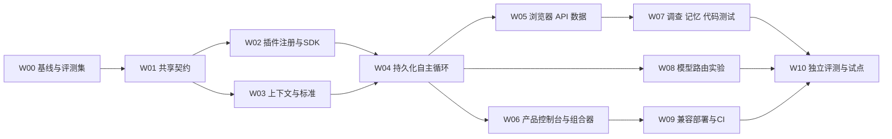

# 2.0 开发路线、依赖与完成定义

> 不是“剩三个外部配置就完成”。2.0 包含实质性的执行内核、插件协议、上下文和评测工程。按验收门推进；没有工时测量前不承诺几天实现通用QA。

## 1. 工作顺序

持续运行W00基准与既有1.0回归。先实现一个可信的端到端业务流程，再扩大动作和项目；不能先做十个菜单，再用占位结果连起来。

## 2. 开发工作包

| 包 | 交付 / 主要目录 | 完成定义 | 依赖 / 发布阶段 |
|---|---|---|---|
| W00 | 基线盘点、兼容矩阵、评测清单和隐藏真值；docs、隔离evaluations | 历史结果可复现；mock/real/业务区分；完整样本缺口可见 | 无；全程 |
| W01 | Capability/Oracle/Session/Invocation/Context/Finding契约及迁移方案；packages/contracts、Python生成类型 | 双端共用正反向量；v1不变；字段语义与错误码冻结 | W00；Alpha |
| W02 | 注册表、TS SDK、Python远程协议、安装/权限/版本、回放；API/worker/运行器 | 两个独立插件不改dispatcher；坏Schema/撤权/错版本拒绝 | W01；Alpha基础，Beta完善 |
| W03 | 实际上下文检索、覆盖地图、Oracle版本与选择记录；Python、API | 规划确实消费批准原文；缺口/冲突/截断可审计，标准不可被动作修改 | W01；Alpha基础，Beta完善 |
| W04 | Observe→Plan→Act→Verify→Adapt、检查点/预算/副作用对账；worker、运行器 | DOM变化改变动作；原标准不变；kill/重复/取消/租约反例通过 | W02+03；Alpha |
| W05 | DOM/视觉候选引擎、复杂控件、API交叉校验、角色和资源生命周期 | 健康/缺陷/修复对照；账号/未知写入/清理失败明确；跨源边界有效 | W04；Beta |
| W06 | 统一接入、准备、实时控制台、待办、缺陷、画布+表单、真实模板 | 三种真实模板运行；无JSON必填；移动/键盘可用，空态真实 | 接入页面可始于W01，控制台依赖W04；Beta |
| W07 | 调查假设/反证、记忆消费、复现最小化、候选测试和变异检查 | 有实际证据支持调查；Node/Python测试补丁经缺陷对照，非mock | W05；Beta |
| W08 | 生成/视觉/决策协议、可选Jev、预算与质量A/B | 不配置Jev仍可运行；用冻结数据决定采用，不夸性能 | W04，真实预算/凭据；Beta |
| W09 | Node/Python支持矩阵、运行器模板、GitHub CI、迁移备份恢复 | 干净安装、旧新版本报告恢复、真实CI；未知技术栈明示不支持 | W02+05+06；Beta/发布候选 |
| W10 | 独立评审、3项目业务评测、两周试点、可用性测试、修复与完整重跑 | EVALUATION全部门通过，PRD P0/P1逐项有证据，宣传一致 | W05～09与外部资料；正式版 |

### W04 必须先完成的最小闭环

批准“草稿创建→修改名称→刷新核验”，冻结Oracle，运行中改变按钮定位 → 系统重新观察找到新入口 → 创建仅一个资源 → 在写入回执前退出进程 → 恢复核对原资源 → 继续持久化断言 → 留证据 → 清理。另一个故障构建故意不保存名称，必须稳定报业务FAIL，不得自修复为通过。

这个流程同时证明自主性、业务标准稳定、恢复和真实性，比增加能力目录条数更有价值。

## 3. PRD 覆盖对账

| 工作包 | 对应功能 |
|---|---|
| W00/W10 | PRD成功指标、发布门；EVALUATION全篇 |
| W01/W03 | CTX-01～06、DES-01～06、INT-07基础 |
| W02 | HAR-01～04、HAR-06～07、OPS-01基础 |
| W04 | LOOP-01～08、DES-03、INT-05/07 |
| W05 | EXE-01～08、INT-01 |
| W06 | HAR-05、UX-01～05，CTX-01入口 |
| W07 | CODE-02～04/06、INT-02～04 |
| W08 | INT-05～07（模型协议/可选Jev） |
| W09 | CODE-01/05、OPS-01～04 |

每条需求最终要关联：实现提交、自动检查、真实执行证据、未完成限制。表格只有勾选但没有证据不算交付。

## 4. 每包提交规范

1. 先确认冻结契约、现有实现和受影响调用方，再开始编码。
2. 实现最小完整纵向路径，禁止在正式节点返回假成功或常量占位。
3. 失败行为与正路一起实现，覆盖真实边界；低影响文档改动无需套完整运行器测试。
4. DB/浏览器/网络副作用相关变更用隔离真实组件验证；mock标明只证明什么。
5. 执行适当回归、类型检查；保存实际命令/数量/跳过项与可复现输入。
6. 更新能力状态与已知限制；独立审查后合并，不能以“代码已写”替代通过验收。

合并顺序：共享契约 → SDK/上下文 → 循环 → 真实适配与界面 → 调查/模型/工程扩展 → 完整评测。小步合并和功能开关优于长期巨大分支。

## 5. 不需要外部资料就能做的工作

W01～04内核、SDK样例、模拟/回放、隔离副作用故障、统一UI状态、预算/租约、v1兼容与契约反例。使用明确标注的合成系统，不冒充客户试点。

需要外部输入才能结项的内容：真实完整PRD/账号/授权环境、第二第三项目、真实模型预算、GitHub App配置、人工基线参与者。缺失时继续独立开发，但保留真实发布门“未验证”，不能自行授权模型调用或业务写入。

## 6. 阶段完成定义

- **Alpha**：W01～04最小闭环、两个独立插件、不可变标准和故障恢复；可供开发者试验，不宣称通用替代QA。
- **Beta**：W05～09完整功能、全部P0/P1有实现与模块验证；启动独立业务评测和持续试点。
- **2.0正式版**：W10完成，固定范围真实指标达标、无不可豁免失败、支持矩阵与营销一致。

若超期，调整发布日期或明确另发较小范围版本；不要事后把必要能力从2.0清单删除并宣称原目标已完成。
